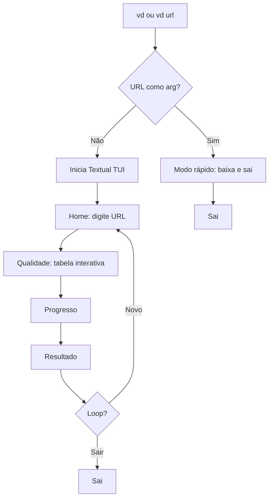

# Plano: Melhorias no CLI Video Downloader

## Contexto Atual

- **Stack**: Python + Typer + Rich
- **Fluxo**: `vd` ou `vd url` → Typer parse → download com `typer.prompt()` para escolher qualidade
- **Bug ^M**: `typer.prompt()` está recebendo CR (carriage return) — comum em terminais/line endings

---

## 1. Migrar Interface para Textual

Substituir Rich + prompts por uma TUI completa com [Textual](https://textual.textualize.io/).

**Estrutura proposta:**

- App principal (`TextualApp`) com telas/screens
- **Screen 1 (Home)**: Campo de texto para URL, botão Baixar, sair
- **Screen 2 (Qualidade)**: Tabela interativa navegável (setas + Enter) — resolve o bug ^M
- **Screen 3 (Progresso)**: Barra de download
- **Screen 4 (Resultado)**: Sucesso + opção "Novo download" ou "Sair"

**Arquivos afetados:**

- Novo: `video_downloader/tui.py` — app Textual com widgets
- Modificar: [cli.py](video-downloader/video_downloader/cli.py) — delega para Textual ou roda fluxo direto no modo rápido
- [ui.py](video-downloader/video_downloader/ui.py) — manter helpers (format_size, etc.) ou mover para tui
- [requirements.txt](video-downloader/requirements.txt) — adicionar `textual`

**Diagrama de fluxo:**

---

## 2. Modo "Aberto" (Loop)

Quando `vd` é executado **sem URL**:

- Inicia a TUI
- Após cada download concluído → volta à tela Home para nova URL
- Usuário sai explicitamente (tecla Q ou botão Sair)

Quando `vd url` (modo rápido):

- Não entra na TUI completa
- Baixa direto e termina — sem loop

---

## 3. Correção do Bug ^M na Tabela

A migração para Textual naturalmente resolve o problema:

- Textual controla o teclado (`key` events)
- A tabela será um `DataTable` ou `SelectionList` navegável
- Enter = selecionar, sem uso de `typer.prompt()` que causava o ^M

Se optar por corrigir sem migrar imediatamente: trocar `typer.prompt()` por `Questionary.select()` ou fazer `input().strip().replace('\r','')` antes de processar.

---

## 4. Modo Rápido: URL sem Aspas

**Comportamento desejado:** `vd video-url` em vez de `vd "video-url"`

- **Limitação:** O shell (bash/zsh) interpreta caracteres como `&`, `?`, `;` — em `vd https://youtube.com/watch?v=abc&list=xyz`, o `&` coloca o processo em background. Aspas evitam isso.
- **O que o app pode fazer:**
  - Aceitar a URL como argumento posicional único (já faz)
  - Garantir que `vd https://youtu.be/ABC123` funcione sem aspas (URLs simples)
  - Documentar no README: URLs com `&` exigem aspas no shell
  - **Opção extra:** Se o usuário passar `vd` sem args, abrir TUI e permitir colar a URL (sem problemas de shell)

---

## Ordem de Implementação Sugerida

1. **Fix ^M** (rápido): Substituir `typer.prompt` em `pick_quality` por `Questionary.select` — desbloqueia uso imediato
2. **Modo aberto vs rápido**: Separar fluxo em `main()` — com URL = baixa e sai; sem URL = loop/TUI
3. **Migração Textual**: Criar `tui.py`, integrar telas, migrar `pick_quality` para DataTable interativo
4. **Docs**: Atualizar README com exemplos de uso (com/sem aspas)

---

## Arquivos Principais

| Arquivo                   | Ação                                                            |
| ------------------------- | --------------------------------------------------------------- |
| `video_downloader/cli.py` | Refatorar: ramificação modo rápido vs TUI, remover typer.prompt |
| `video_downloader/tui.py` | Criar: app Textual com screens                                  |
| `video_downloader/ui.py`  | Manter utilitários ou integrar em tui                           |
| `requirements.txt`        | Adicionar textual (+ questionary para fix rápido)               |

---

## Dependências Novas

- `textual` — framework TUI
- `questionary` (opcional para fix imediato do ^M antes da TUI completa)

